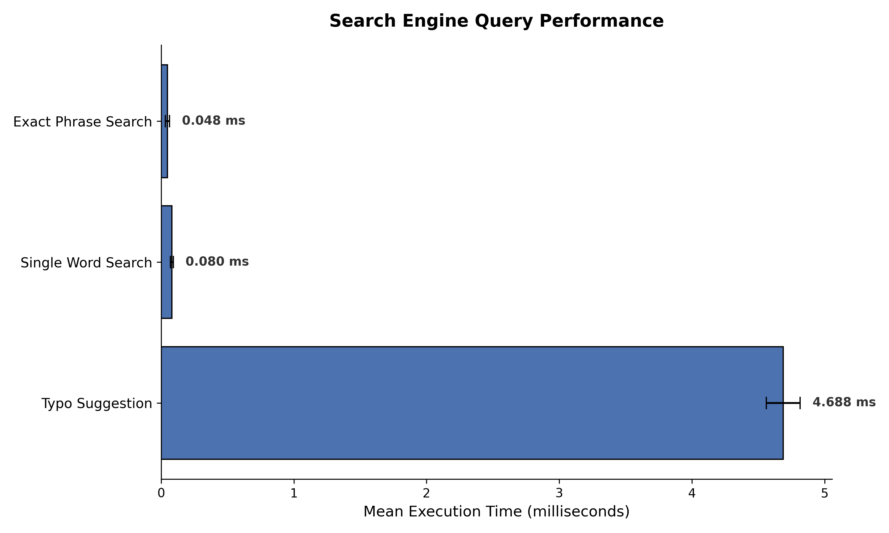
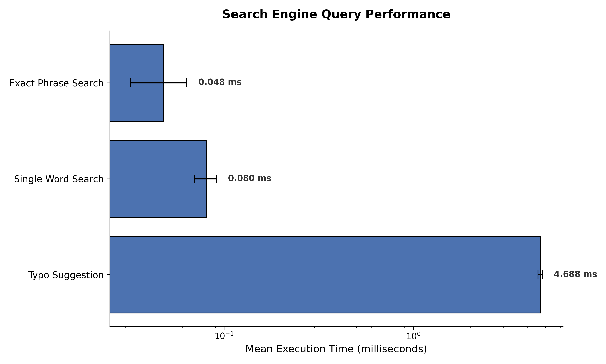

# COMP3011 Search Engine Tool

[](https://github.com/harryw358/search-engine/actions)
*Note: Please see 'Actions' tab for a detailed output of automated testing pipeline.*

## Project Overview and Purpose
This project is a command-line search engine tool developed for the COMP3011 Web Services and Web Data module. It is designed to crawl the target website ([http://quotes.toscrape.com/](http://quotes.toscrape.com/)), to extract quote text and their authors, and construct an inverted index.

The tool processes the extracted text by lowercasing and stripping punctuation using regular expressions, to ensure case-insensitive searching. It allows users to build and save the index to the file system, load it back into memory, view detailed statistics for individual words, and perform boolean AND searches for multi-word queries.

## Features
* **Recursive Web Crawler:** Uses Breadth-First Search (BFS) to traverse internal links, respecting a 6-second politeness window and gracefully handling network timeouts.
* **Inverted Index:** Tokenises and cleans text, storing term frequencies and exact positional data in a highly optimized JSON structure.
* **TF-IDF Searcher:** Ranks search results using Term Frequency-Inverse Document Frequency to ensure highly relevant page matching.
* **✨ Advanced Query Processing (Exact Phrase Searching):** Supports strict positional filtering using quotation marks (e.g., `"good friends"`) to match exact word sequences.
* **✨ Query Suggestions (Typo Handling):** Utilises Python's `difflib` to detect misspelled or unindexed words and offers intelligent "Did you mean?" suggestions.

## Dependencies
This project requires Python 3.10+ and the following third-party libraries:
- ```requests```: For making HTTP requests and managing sessions during the crawling phase.
- ```beautifulsoup4```: For parsing HTML to extract quotes and navigate pagination.
- ```pytest```: For running the automated testing suite.
- ```pytest-benchmark```: For running the benchmarking scripts.
- ```matplotlib```: For visualising the benchmarking results.

## Installation and Setup
1. **Clone the repository:**
```bash
git clone https://github.com/harryw358/search-engine.git
```
2. **Create and activate a virtual environment:**
  - **Mac/Linux**:
    ```bash
    python3 -m venv venv
    source venv/bin/activate
    ```
  - **Windows**:
    ```bash
    python -m venv venv
    venv\Scripts\activate
    ```
3. **Install the dependencies:**
  Ensure you are in the root directory of the project (```search-engine/```), then run:
  ```bash
  pip install -r requirements.txt
  ```

## Command Usage Examples
To start the search engine's command line interface, ensure you are in the root directory of the project (```search-engine/)``` and run the following command:
```bash
python -m src.main
```
Once the interactive prompt (```>```) appears, you can use the following four main commands:
1. **```build```**
crawls the target website, whilst respecting a 6-second politeness window, to build the inverted index from the scraped text, and saves it to a single file at ```data/index.json```.
  - **Example:**
    ```plaintext
    > build
    ```
2. **```load```**
loads the previously saved inverted index from ```data/index.json``` into the application's memory so it can be queried. **You must run this (or ```build```) before attempting to search.**
  - **Example:**
    ```plaintext
    > load
    ```
3. **```print <word>```**
prints the inverted index statistics (URLs, frequencies, and word positions) for a speciic word. The search is case-insensitive.
  - **Example:**
    ```plaintext
    print einstein
    ```
4. **```find <query>```**
finds and returns a list of all pages containing the specified search terms. For multi-word queries, it performs a boolean AND search (returning only pages that contain _all_ the words.
  - **Examples:**
    ```plaintext
    > find indifference
    > find good friends
5. **```quit```** or **```exit```**
gracefully exists the search engine tool.

### Advanced Search Features
You can utilise advanced query processing directly in the CLI:

* **Exact Phrase Searching:** Wrap your query in quotation marks to find pages where words appear in exact consecutive order.
  `> find "albert einstein"`
* **Typo Auto-Correction:** Type a misspelled word to see the suggestion engine in action.
  `> find enstein`
  *(Output: "No results for 'enstein'. Did you mean: 'einstein'?")*

## Testing Instructions
This project uses ```pytest``` for comprehensive unit and integration testing, including mocks for network requests to ensure tests run quickly and reliably without hitting the live website.
To run the entire test suite covering the crawler, indexer, and search modules:
1. Ensure you are in the root directory of the project (```search-engine/```).
2. Run the following commmand:
   ```bash
   python -m pytest tests/ -v
   ```

Should you wish to test each invidual component of the search engine independently, you can also run the following three commands:
1. ```bash
   python -m pytest tests/test_crawler.py -v
   ```
2. ```bash
   python -m pytest tests/test_indexer.py -v
   ```
3. ```bash
   python -m pytest tests/test_searcher.py -v
   ```
### Continuous Integration:
This project is also configured with a GitHub Actions CI pipeline (```.github/workflows/python-tests.yml```). Every time code is pushed to the repository, the test suite is automatically executed in a cloud environment to ensure code stability and prevent regressions.

### Performance Benchmarks
To ensure the search engine scales efficiently, execution times were profiled using `pytest-benchmark`. The system successfully leverages the O(1) constant lookup time of the Inverted Index dictionary to return complex TD-IDF rankings in milliseconds.



*Note: Evaluated on a locally built index of 213 pages w/ 4678 unique words. Second graph uses a logarithmic scale to properly visualise the computational differences between standard exact-matching and the more intensive difflib suggestion algorithm.*
